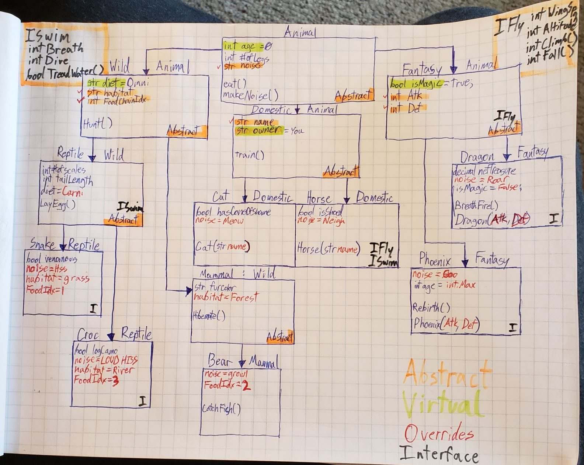

# Lab06/Lab07-OOP Principles
*by Harry Cogswell*
A Class structure that represents the hierarchu of different animal varieties in a zoo.

----

## Description
In This program, you won't find a lot of functionality, but instead various instances of 7 different animals, all in various categories, inheriting attributes and behaviors from more general categories above them. For a better visual, see the image below:

---

### Visual

---

### Object-Oriented-Programming Principles

---

#### Inheritance
Inheritance is often considered first among equals in the four pillars of OOP. Inheritance is what allows classes to retain the attributes and behaviors of the base class that they are derived from, and from the base class that was derived from, and so on. Inheritance is our biggest savior when trying to produce DRY code (Don't-Repeat-Yourself). If you find yourself creating the same or similar properties for two different classes, consider going up the ladder a step and building a base class for each of them to derive those properties from.
- Inheritance in this program is demonstrated in that all particular, concrete animals have a noise (The cat, the dragon, the bear, etc.), even though that Noise trait was first implemented in the base animal class.
#### Polymorphism
Polymorphism is the ability in OOP languages to consider an instance of an class both as its direct class type, and at the same time, as its base class type. Either implicitly or explicitly, any derived class in C# can be used in place of its parent, or grandparent, or so on.
- In my program, I created an Animal array, but then filled it with instances of the Dragon, Crocodile, and Horse classes, and the program was still able to compile, use those objects, and consider them each as an instatiated Animal.
#### Encapsulation
Encapsulation sounds like what it is. Where the first two pillars were about the spread and dispersement of behaviors, encapsulation is here to remind us that they still fall under very hard and fast OOP laws. Encapsulation is when a group of methods or members is grouped together and related in some way where they are inaccessible, or semi-accessible from outside that group (in our case, usually a class).
- Like in our previous example, my Animal array of different concrete Animal-based classes can be used to demonstrate encapsulation. While any Animal member is accessible to all my indexes, if I iterate through and try to make the Cat wear a ConeOfShame, I can't do it so indirectly, because only one object has that capability. it is "encapsulated" in the Cat class. Since this Cat is being treated as an Animal, it can't wear a cone of shame.

#### Abstraction
Abstraction seems confusing at first, but it's really a familiar concept for anyone who has worked with MS Office. Abstraction is basically the concept of building templates. Just like that nice fresh resume template you downloaded, you can't just use something abstract right away. You have to build your own, personalized version of it. Fill in your name, say what you do, define your age and experience. Abstraction is a way for us to reuse the same base shape of a class, while still editing and adjusting its inner workings; Or more accurately, it's like we know what the class should do, but not HOW it should do it.
- I used plenty of abstract members in my code, but I think the best demonstration of abstraction is my Diagram above. Every thing is planned out, which made it easy to write the code quickly and well-organized. But I still had to write the code. I couldn't run unit testing on a sheet of paper. I can't run visual studio's debugger on drawing. It was an *abstraction*, that I then *implemented* with C# in my IDE.

---

### Special Mention: Interfaces
Interfaces I like to think of in the same vein as methods. You have a method definition, with all your logic planned out, but it won't do anything til you pass some arguments in and call it. Likewise, an Interface is similar to our abstract base classes, they provide a framework of properties and methods that won't do anything until we implement that interface into a new class. Like calling methods, we can implement any number of interfaces into our class, and they can work together to build up something very complicated and detailed, but still clean and DRY to look at.
- My first interface was IFly, because I wanted my fantasy creatures to be able to fly, but I also wanted to give my horses wings if I so chose. So IFly is implemented by the Base Class Fantasy, and inherited by Dragon and Phoenix, whereas the Concrete Derived class Horse directly implements IFly in its class definition. IFly gives animals a wingspan, an altitude, and the ability to change their altitude with fall or climb methods.

- My second interface was ISwim, because all of my reptiles should be able to swim, but I want my horses to be able to cross that Oregon trail rive if necessary. Like with IFly, ISwim was directly implemented into the Reptile class, then inherited by its children, while Horse implemented IFly directly again (wow, my Horse class is getting busy here). ISwim lets animals have a time frame they can hold their breath, and allows them to dive underwater or tread water in place, depending on their breath control.
